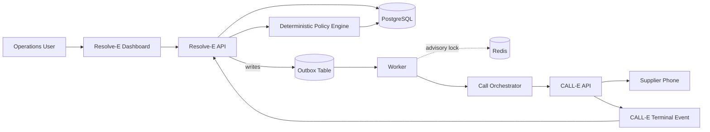
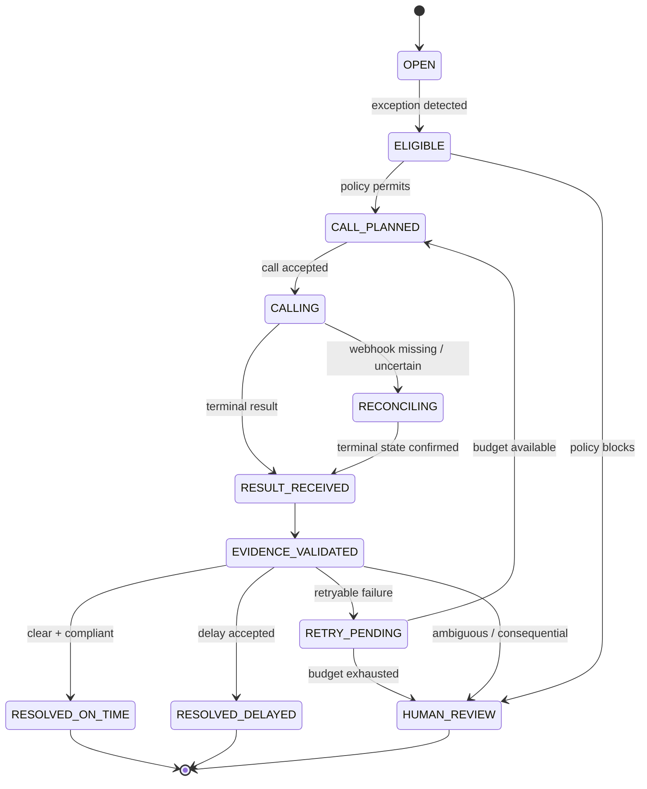
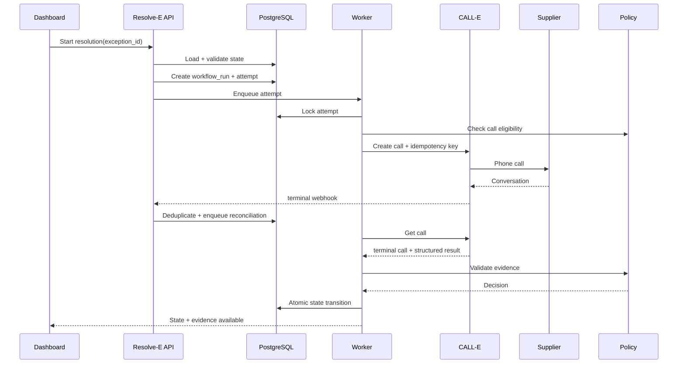
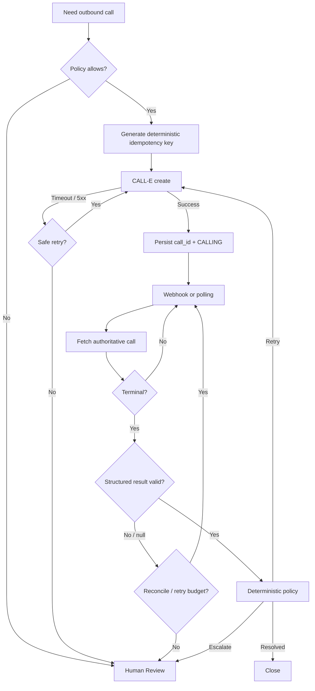
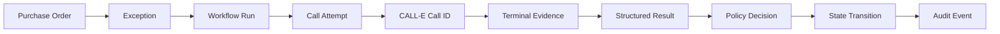

# Architecture and Workflow Diagrams

## 1. System context

The outbox table -- not Redis -- is the queue: it is written in the same
transaction as the state change that produced it, which a Redis-backed queue
cannot be (`backend/app/workers/runner.py`). Redis is used only for an
advisory distributed lock and a wake-up nudge.

## 2. Closed-loop resolution

## 3. Sequence diagram

## 4. Failure-aware call flow

## 5. Data lineage

